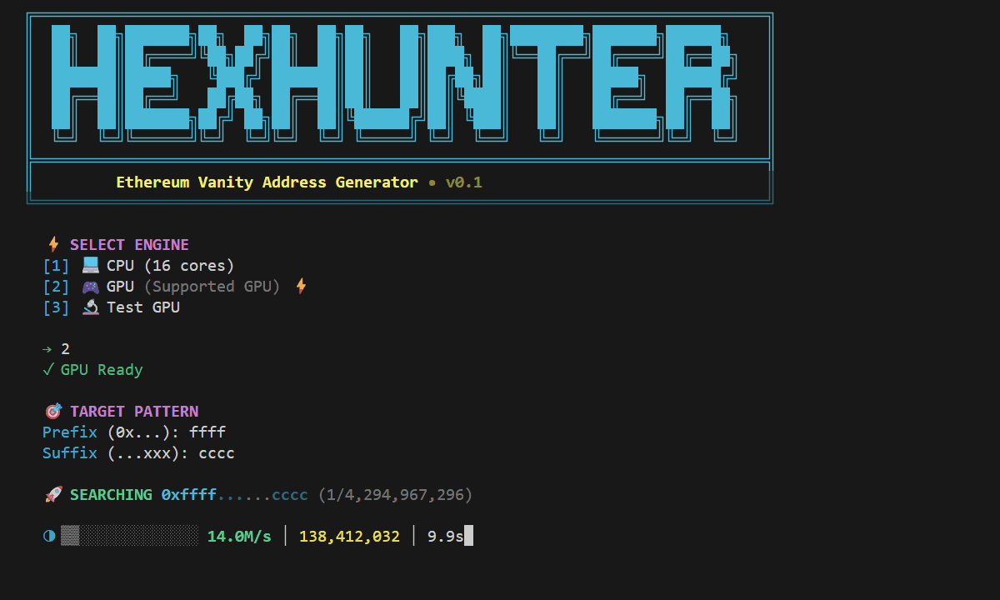
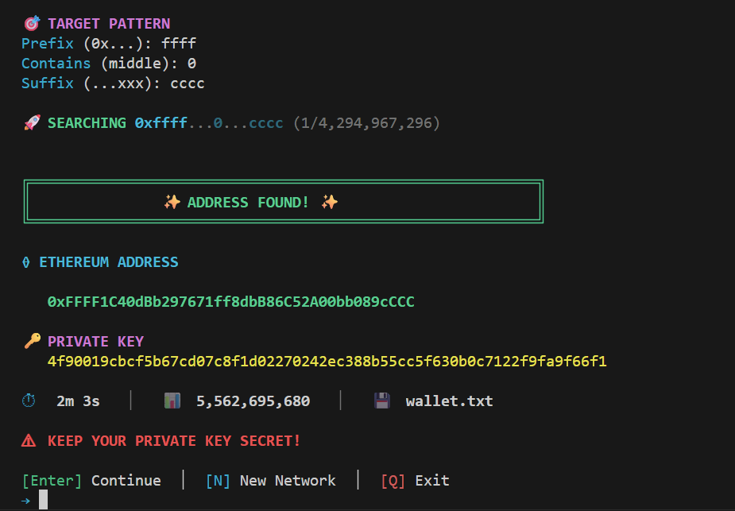

<div align="center">


# 🎯 HexHunter

### *The Ultimate Multi-Chain Vanity Address Generator*

[](https://golang.org)
[](https://www.khronos.org/opencl/)
[]()


[](https://github.com/Amr-9/HexHunter/releases)

#### Supported Networks
[]()
[]()
[]()
[]()
[]()
[]()
[]()
[]()
[]()

---


**Generate custom vanity addresses for multiple blockchains with your desired prefix or suffix at blazing speeds using GPU acceleration.**

[Features](#-features) • [Installation](#-installation) • [Usage](#-usage) • [Performance](#-performance) • [How It Works](#-how-it-works) • [Security](#-security)

</div>

---

## 🤔 What is a Vanity Address?

A **vanity address** is a custom blockchain address that contains a specific pattern you choose. Instead of a random address, you can create personalized, memorable addresses:

### Examples by Network

| Network | Random Address | Vanity Address | Pattern Used |
|---------|---------------|----------------|--------------|
| **Ethereum/EVM** | `0x7a3f8b2c...` | `0xdeadbeef...` | Hex words |
| **Ethereum/EVM** | `0x9c4e2d1a...` | `0x00000000...` | Leading zeros |
| **Tron** | `TJRyWwFs9...` | `TRoN...` | Base58 words |
| **Tron** | `TLa2f6VP...` | `TTTT...` | Repeating chars |
| **Solana** | `7xKXtg2CW...` | `So1anaWa11et...` | Base58 words |
| **Bitcoin (Taproot)** | `bc1p5cyxnuxm...` | `bc1pcafe...` | Bech32m |
| **Bitcoin (Legacy)** | `1BvBMSEYstW...` | `1Love...` | Base58 |
| **Aptos** | `0x8f3a...` | `0x0000...` | Hex patterns |
| **Sui** | `0x7b2c...` | `0xdead...` | Hex patterns |

### Why Use a Vanity Address?

✅ **Easy Recognition** - Instantly identify your address in transaction lists  
✅ **Reduced Errors** - Less chance of sending funds to the wrong address  
✅ **Professional Look** - Great for businesses, projects, and personal branding  
✅ **Memorable** - Easier to remember and verify

---

## 🌟 Why HexHunter?

| Other Tools | HexHunter |
|-------------|-----------|
| ❌ Require Python/Node.js setup | ✅ Single standalone `.exe` file |
| ❌ Complex command-line flags | ✅ Interactive menu - just type your pattern |
| ❌ Pattern matching on CPU | ✅ In-kernel GPU matching (3x faster!) |
| ❌ Write all results to memory | ✅ Zero memory writes until match found |
| ❌ Outdated or unmaintained | ✅ Modern codebase with latest optimizations |

---

## 🔗 Supported Networks

| Network | Address Format | GPU Accelerated | Notes |
|---------|---------------|-----------------|-------|
|  **Ethereum (EVM)** | `0x...` (hex) | ⚡ **Yes** | Supports all EVM chains (BSC, Polygon, Arbitrum, etc.) |
|  **Tron** | `T...` (Base58) | ⚡ **Yes** | Same curve as Ethereum (secp256k1) |
|  **Solana** | Base58 | ⚡ **Yes** | Ed25519 curve |
|  **Aptos** | `0x...` (hex) | ⚡ **Yes** | Ed25519 curve |
|  **Sui** | `0x...` (hex) | ⚡ **Yes** | Ed25519 curve |
|  **Bitcoin** | P2TR/P2PKH/P2SH | 💻 CPU only| Taproot, Legacy, SegWit |

---

## ✨ Features

| Feature | Description |
|---------|-------------|
| 🌐 **Multi-Chain Support** | Generate vanity addresses for Ethereum, Tron, Solana, Aptos, Sui, and Bitcoin! |
| 🚀 **Zero Dependencies** | Just download and run - no Go, Python, or Node.js required! |
| 🔒 **100% Offline** | Works completely offline - your keys never leave your device |
| 🎮 **GPU Acceleration** | Harness the power of your GPU with OpenCL for 40M+ addresses/sec (ETH/TRX/SOL/APT/SUI) |
| 💻 **CPU Fallback** | Fully functional multi-threaded CPU mode for all networks |
| 🔐 **Cryptographically Secure** | Uses OS-level secure random (`CryptGenRandom`/`/dev/urandom`) |
| 🔄 **Continuous Mode** | Generate multiple addresses without restarting |
| 🎨 **Beautiful TUI** | Modern terminal interface with real-time progress |
| 💾 **Auto-Save** | Results automatically saved to `wallet.txt` |
| ⚡ **Self-Initializing** | Auto-generates optimization tables on first run |

---

## 🚀 Installation

### Prerequisites

- **Go** 1.20 or higher
- **GCC** (for CGO compilation)
- **OpenCL SDK** (for GPU acceleration)
  - NVIDIA: CUDA Toolkit
  - AMD: AMD APP SDK or ROCm
  - Intel: Intel OpenCL Runtime

### Option 1: Pre-built Binaries (Recommended)

Just download and run - **no Go installation required!**

1. Download the latest release from the [Releases](https://github.com/Amr-9/HexHunter/releases) page
2. Run `HexHunter.exe`
3. Done! 🎉

### Option 2: Build from Source

```bash
# Clone the repository
git clone https://github.com/Amr-9/HexHunter.git
cd HexHunter

# Build the application
./build.ps1     # Windows
./build.sh      # Linux/macOS
```

> **Note**: On first GPU run, HexHunter automatically generates a ~64MB optimization table (`tables.bin`). This takes a few seconds and only happens once.


---

## 📖 Usage

### Quick Start

```bash
./HexHunter.exe
```

### Interactive Menu

1. **Select Engine**: Choose between CPU or GPU mode
2. **Enter Prefix**: The characters you want your address to start with (after `0x`)
3. **Enter Suffix**: The characters you want your address to end with
4. **Wait**: HexHunter will search for matching addresses
5. **Continue or Exit**: Press Enter to search again with new patterns, or Q to exit

### Example

```
    🎯 TARGET PATTERN
    Prefix (0x...): dead
    Suffix (...xxx): beef

    🚀 SEARCHING 0xdead...beef (1/4,294,967,296)
```

### Pattern Examples

| Pattern Length | Example | Difficulty | Est. Time (45 MH/s) |
|:--------------:|:--------|:-----------|:--------------------|
| **4 chars** | `0xdead...` | 1 in 65,536 | **Instant** (< 0.01 sec) |
| **5 chars** | `0xdead1...` | 1 in 1,048,576 | **Instant** (~0.02 sec) |
| **6 chars** | `0xdeadbe...` | 1 in 16,777,216 | **~0.4 seconds** |
| **7 chars** | `0xdeadbea...` | 1 in 268,435,456 | **~6 seconds** |
| **8 chars** | `0xdead...beef` | 1 in 4,294,967,296 | **~1.5 minutes** |
| **9 chars** | `0xdeadbeef1...` | 1 in 68,719,476,736 | **~25 minutes** |
| **10 chars** | `0xdeadbeef12...` | 1 in 1,099,511,627,776 | **~7 hours** |
| **11 chars** | `0xdeadbeef123...` | 1 in 17,592,186,044,416 | **~4.5 days** |
---

## ⚡ Performance



### Benchmarks

| Mode | Hardware | Speed |
|------|----------|-------|
| GPU | NVIDIA RTX 4090 | ~240 MH/s |
| GPU | NVIDIA RTX 4060 | ~45 MH/s |
| CPU | Intel i9-14900K | ~600 KH/s |
| CPU | AMD Ryzen 9 7950X | ~550 KH/s |

> **Note**: GPU performance is approximately 50-100x faster than CPU mode.

### Optimization Techniques

- **Precomputed Tables**: 64MB lookup table with 2^20 precomputed EC points
- **Batch Inversion**: Montgomery batch inversion for efficient modular division
- **Mixed Addition**: Jacobian + Affine point addition for reduced operations
- **Parallel Processing**: Thousands of GPU threads working simultaneously

---

## 🔧 How It Works

### Architecture

```
┌─────────────────────────────────────────────────────────────┐
│                        HexHunter                            │
├─────────────────────────────────────────────────────────────┤
│  ┌─────────────┐    ┌─────────────┐    ┌─────────────────┐ │
│  │   CPU Host  │───▶│  GPU Kernel │───▶│ In-Kernel Match │ │
│  │  (Go + CGO) │    │  (OpenCL)   │    │ (Prefix/Suffix) │ │
│  └─────────────┘    └─────────────┘    └─────────────────┘ │
│         │                  │                    │           │
│         ▼                  ▼                    ▼           │
│  ┌─────────────┐    ┌─────────────┐    ┌─────────────────┐ │
│  │ Random Base │    │ EC Point    │    │   Only Write    │ │
│  │    Key      │    │  + Keccak   │    │   On Match! ⚡  │ │
│  └─────────────┘    └─────────────┘    └─────────────────┘ │
└─────────────────────────────────────────────────────────────┘
```

### Key Generation Flow

1. **Generate Random Base Key**: Cryptographically secure random 256-bit integer
2. **Compute Base Point**: `BasePoint = base * G` (secp256k1 generator)
3. **GPU Batch Processing**: 
   - Load precomputed table (i * G for i = 0 to 2^20)
   - Compute `P[i] = BasePoint + Table[i]`
   - Apply Keccak-256 hash
   - Extract last 20 bytes as Ethereum address
4. **In-Kernel Matching**: Check prefix/suffix inside GPU (zero memory writes until match!)
5. **Iterate**: Increment base key and repeat

---

## 🔐 Security

### Cryptographic Standards

- **Random Number Generation**: Uses Go's `crypto/rand` which reads from:
  - Windows: `CryptGenRandom`
  - Linux: `/dev/urandom`
  - macOS: `getentropy()`

- **Elliptic Curve**: secp256k1 (same curve used by Ethereum and Bitcoin)

- **Hashing**: Keccak-256 (Ethereum's address derivation standard)

### Security Best Practices

> ⚠️ **IMPORTANT**: Keep your private keys secure!

1. **Never share your private key** with anyone
2. **Store wallet.txt securely** or delete after transferring keys
3. **Use in a secure environment** - avoid public/shared computers
4. **Verify addresses** before transferring funds

---

## 📁 Project Structure

```
HexHunter/
├── cmd/
│   └── hexhunter/
│       └── main.go              # Application entry point
├── internal/
│   └── ui/
│       ├── console.go           # TUI display & progress
│       └── input.go             # User input handling
├── pkg/
│   └── generator/
│       ├── generator.go         # Generator interface & types
│       ├── common/              # Shared GPU kernel components
│       │   ├── kernel_utils.go  # OpenCL kernel loading utilities
│       │   └── kernels/
│       │       └── ed25519_core.cl  # Shared Ed25519 implementation
│       ├── cpu/                 # CPU fallback implementation
│       │   └── cpu.go           # Multi-threaded CPU generator
│       ├── ethereum/            # Ethereum/EVM support (GPU ⚡)
│       │   ├── gpu.go           # OpenCL GPU implementation
│       │   ├── matcher.go       # Pattern matching
│       │   ├── table_gen.go     # Precomputed EC tables
│       │   └── kernels/
│       │       └── vanity_v4.cl # secp256k1 + Keccak kernel
│       ├── tron/                # Tron support (GPU ⚡)
│       │   ├── gpu.go           # Reuses secp256k1 with Base58Check
│       │   ├── matcher.go       # Base58 pattern matching
│       │   ├── address.go       # Tron address encoding
│       │   └── kernels/
│       │       └── tron_kernel.cl
│       ├── solana/              # Solana support (GPU ⚡)
│       │   ├── gpu.go           # Ed25519 GPU implementation
│       │   ├── kernel_builder.go # Combines core + network kernel
│       │   ├── matcher.go       # Base58 pattern matching
│       │   └── kernels/
│       │       └── solana_kernel.cl
│       ├── aptos/               # Aptos support (GPU ⚡)
│       │   ├── gpu.go           # Ed25519 + SHA3-256
│       │   ├── kernel_builder.go
│       │   ├── matcher.go       # Hex pattern matching
│       │   └── kernels/
│       │       └── aptos_kernel.cl
│       ├── sui/                 # Sui support (GPU ⚡)
│       │   ├── gpu.go           # Ed25519 + Blake2b-256
│       │   ├── kernel_builder.go
│       │   ├── matcher.go       # Hex pattern matching
│       │   └── kernels/
│       │       └── sui_kernel.cl
│       └── bitcoin/             # Bitcoin support (CPU only)
│           ├── address.go       # P2TR/P2PKH/P2SH encoding
│           ├── address_types.go # Address type definitions
│           ├── crypto.go        # secp256k1 operations
│           ├── matcher.go       # Bech32/Base58 matching
│           └── validation.go    # Address validation
├── deps/
│   ├── opencl-headers/          # OpenCL header files
│   └── lib/                     # OpenCL libraries
├── build.ps1                    # Windows GPU build
└── build.sh                     # Linux/macOS build
```

---

## 🤝 Contributing

Contributions are welcome! Please feel free to submit a Pull Request.

1. Fork the repository
2. Create your feature branch (`git checkout -b feature/AmazingFeature`)
3. Commit your changes (`git commit -m 'Add some AmazingFeature'`)
4. Push to the branch (`git push origin feature/AmazingFeature`)
5. Open a Pull Request

---

## ⚠️ Disclaimer

This software is provided for educational and research purposes only. The authors are not responsible for any misuse or for any damages resulting from the use of this software. Always ensure you are complying with local laws and regulations when using cryptocurrency-related software.

**The developer is innocent before God of any illegal or malicious use of this tool.**
**(أبرأ إلى الله من أي استخدام غير قانوني أو ضار لهذه الأداة)**

---

## 📜 License

This project is licensed under the **GNU General Public License v3.0** (GPL-3.0).
You are free to use, modify, and distribute this software, but you must keep it open-source and provide the same rights to others.

---

<div align="center">

**Made with ❤️ for the Crypto Community**

⭐ Star this repo if you find it useful!

</div>
